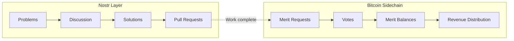
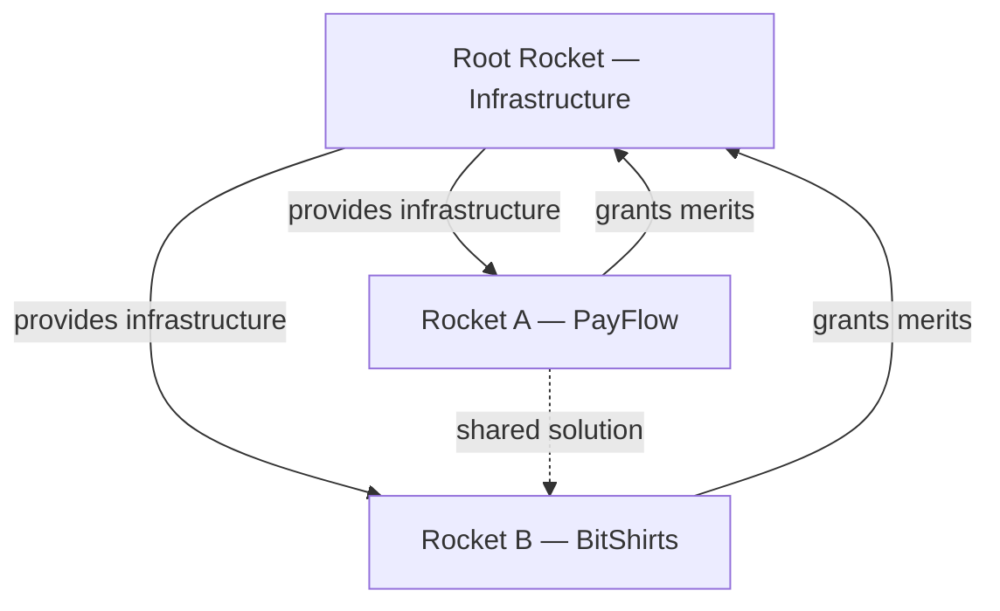

# The Nostrocket Unprotocol

Everything in Nostrocket reduces to one loop: find a problem, solve it, get equity, receive revenue. No interviews. No permission. No funding rounds. Just proof of work, verified by the people who already have skin in the game.

By the end of this chapter, you'll understand the unprotocol precisely enough that you could implement it, and plainly enough that you shouldn't need to be a developer to follow it.

---

## What is the Unprotocol

The usefulness of a bucket exists due to the limitations imposed by its base and sides. A bucket is useful because it holds water by creating *boundary conditions* on what the water *cannot* do while *remaining in the bucket*.

Nostrocket works the same way. The unprotocol doesn't tell anyone what to build, how to build it, or when to build it. It simply defines the boundary conditions on human action within a Rocket — what you *cannot* do while still be operating within the system. Everything else is up to you.

This isn't a metaphor. It's the core design principle. The unprotocol is a set of simple rules that create the conditions for complex, emergent behaviour: products, services, and solutions that no one *necessarily* planned in advance. Projects like ZeroMQ have proven that valuable software can evolve from simple rules with no upfront planning or leadership. Nostrocket applies the same principle to entire organizations.

The unprotocol's fitness function (what it optimizes for) is **increasing the number of Participants**. Profit is in the critical path to increased participation, but blindly chasing profit has proven to have disastrous consequences — it's how you end up with the same extractive, parasitic structures we're trying to replace.

By optimizing for participation, we ensure that profitability actually serves the interests of participants and, by extension, the rest of humanity. The two aren't in tension; participation is just the more honest measure. 

With that foundation, let's examine the structural principles that make this possible.

---

## Why Mutexless

Most organizations slow down as they grow. This isn't a people problem — it's a structural one, described by Amdahl's Law.

Amdahl's Law is a formula from computer science that describes the maximum speedup you can get by executing a task with more processors (or threads). The formula is simple: if any fraction of the work must be done sequentially (one step at a time), then that fraction creates a hard ceiling on how much speedup you get by adding more processors.

The math is unforgiving. If 5% of a task is sequential, adding more than 20 processors gives you no additional speedup. Raise that to 25% sequential and the ceiling drops to 4. At 50%, it's 2. Any extra processing capacity sits idle, doing nothing.

Human organizations follow the same law. People are the processors. Every meeting, approval chain, code review, and planning session is a sequential operation or "mutex". In a typical company, employees spend 20–30% of their time in some form of mutex. Amdahl's Law caps the effective team size at 3-5. You can add more people to the team, but this just increases costs and does not increase meaningful output. Amazon's "two pizza rule" is a practical admission of this ceiling.

Nostrocket is designed to be "mutexless" — a structure where there's no leadership to wait for, no meetings, no one *needs* permission or upfront agreement to do productive work. As the serial fraction approaches zero, the limit on team size approaches infinity.

A contributor identifies a problem, solves it, and submits the solution. If they didn't violate the protocol, their patch is merged. No coordination, planning, or consensus is required. The unprotocol's boundary conditions ensure independent work converges toward something coherent. As Alan Watts put it: "The river is not pushed from behind, nor is it pulled from ahead. It falls with gravity."

The next question is: what motivates people to participate?

---

## Sovereign Self-Interest as the Engine

Human action within Nostrocket must be executed for purely self-interested reasons. This is not a concession to human nature — it is a design requirement.

When people solve problems because they genuinely care about the problem, the solutions are more accurate than when they're doing it because someone else is managing their priorities. The difference between organic Wikipedia contributions and paid ones illustrates this clearly.

Self-interested action is more efficient, more accurate, more scalable, and minimizes the social attack surface — there's nothing to corrupt if no one is directing anyone.

The unprotocol creates the conditions where self-interest and collective benefit are aligned: solve a real problem, get equity. Your equity becomes more valuable as the project succeeds and people pay to consume its products/services. No one needs to be altruistic.

The Daoists called this quality *ziran*: things unfolding according to their own nature without external compulsion. 

The boundary conditions channel self-interest into productive work the same way water creates a riverbank that channels more water. The *Dao De Jing* describes the ideal result: "Perform actions, accomplish deeds; the people will say it happened naturally." 

---

## Votepower

Votepower is Nostrocket's governance mechanism and is a quantification of "skin in the game". We'll discuss exactly how it works later in this chapter, but here's what votepower can actually do:

1) approve or reject merit requests (converting work to equity),
2) add or remove Maintainers (the people who merge code). 
That's it.

Governance is narrow by design. Votepower doesn't direct strategy, assign work, set priorities, allocate funds, or tell anyone what to build. 

Now let's look at the two technical layers that make the system work.

---

## A Tale of Two Layers: Bitcoin and Nostr

Nostrocket runs on two systems that do very different jobs.

**Nostr** handles everything humans need to coordinate: posting and discussing problems, avoiding duplicated work, arguing about things. 

Nostr is a decentralized social unprotocol — no one owns it, no one can censor it, and anyone can run a relay. All the messy, creative, argumentative, human parts of building things happen here.

**A Bitcoin sidechain** handles only what every participant in a Rocket (contributors, merit holders, and paying customers) must agree on in order to continue operating. 

A customer needs to know what Bitcoin address to pay. Merit holders need to agree on who holds how many merits. Everyone needs to agree on votepower so that votes on merit requests produce the same result no matter who calculates it. 

If uncertainty over a given piece of state would prevent the Rocket from functioning, it goes on the sidechain. If the Rocket can still function without it, it stays on Nostr.

The sidechain layer is deliberately minimal. Consensus is expensive and sometimes retarded — every piece of data that requires Bitcoin-grade agreement slows everything down. 

The problem graph, discussions, code patches, etc need to be public, have proof of provenance, and be censorship resistant. Nostr is adequate for this. 

Merit balances, votepower, revenue distribution, and the votes on merit requests themselves require consensus over global state.



Each layer has its own anti-spam mechanism. On Nostr, the web of trust determines who's content is visible. 

On the sidechain, a proof-of-work system gates initial transactions from new accounts, while merit ownership gates all subsequent transactions.

The sidechain also enforces multi-timeframe rate limiting: transaction growth is capped across multiple time windows (minute, hour, day, week), and as utilization approaches the cap, the required proof-of-work difficulty increases exponentially. 

Organic growth is accommodated while spam attacks become prohibitively expensive — an attacker might briefly spike the one-minute window, but the hourly and weekly rate limits quickly throttle any sustained assault. 

Having established the infrastructure, let's turn to the organizational unit that runs on top of it.

---

## Rockets

A Rocket is a project. Anyone can create one.

But creating a Rocket isn't filing paperwork — it's doing actual work. The founder builds something meaningful first, then creates the Rocket and approves their own initial merit request. 

Technically, a Rocket is instantiated with a single merit — this is the only way to bootstrap the voting process, since approving merit requests requires existing votepower. The founder's initial merit request establishes the first real stake.

Why doesn't this get abused? Because Rockets are competing for contributors. A Rocket with an inflated founding merit request is dead on arrival. No competent person will contribute to a project where the founder gave themselves an unfair share of equity for minimal work. 

The standard to compare against is Bitcoin itself — a system where the creator received no special allocation, mined under the same rules as everyone else, and let the work speak for itself. A founder who wants to attract serious contributors needs to demonstrate that same integrity.

### Example: Bootstrapping a Rocket

Say a developer builds a Cashu payment widget. She creates a Rocket called "PayFlow" and approves her own first merit request for 1,000,000 sats — roughly a day's work at market rates. She's now the first merit holder and Maintainer. Others can find problems in PayFlow's implementation or user experience, solve them, and request their own merits. If she'd claimed 100,000,000 sats for that first day of work, no serious developer would touch the project.

The founder also becomes the first Maintainer — the person with permission to merge code and enforce quality standards. More on that below.

### Multi-Rocket Architecture

Each Rocket has its own independent merit system — its own merit supply, its own merit holders, its own votepower distribution, its own revenue. But Rockets don't exist in isolation. They share the same global problem graph and the same underlying infrastructure.

**Cross-ownership:** Rockets can hold merits in other Rockets. If Rocket A builds something that Rocket B uses, Rocket B's merit holders might approve a merit grant to Rocket A. This creates economic alignment across the ecosystem without requiring any central coordination.

**The Root Rocket:** The foundational Rocket — Nostrocket itself — builds and maintains the unprotocol infrastructure. It generates revenue by receiving merits from other Rockets that use the infrastructure. Like the ocean in the *Dao De Jing* that masters all streams by staying below them, the Root Rocket leads the ecosystem by serving it. This creates a powerful alignment: the Root Rocket's revenue depends on the success of every Rocket built on its infrastructure. It's incentivized to make the infrastructure as good as possible — not to extract rent, but to make every other Rocket more profitable, because their revenue flows back as merits.

**Cross-Rocket merit requests:** When a solution benefits multiple Rockets — say, a shared payment processing library — the contributor can request merits from each Rocket independently. Each Rocket's merit holders vote separately on whether the work was valuable to them. A solution rejected by one Rocket's merit holders might still be approved by another's.



With that architecture in place, let's look at how work gets identified and organized.

---

## The Problem Graph

All work in Nostrocket starts with a Problem.

Pieter Hintjens, the architect of ZeroMQ and one of the clearest thinkers on open-source collaboration, defined a problem as "an observed matter or situation regarded as unsatisfactory." This definition is precise and it matters. A problem is an observation about reality — not a wish, not a feature request, not a suggestion. It describes something that is wrong *right now*, in terms specific enough that someone else can verify the observation independently.

### Example: Valid and Invalid Problem Statements

A valid problem looks like: "New users cannot discover active Rockets because the landing page has no directory." It's specific, it's observable, and you can test whether it's true. An invalid problem looks like: "We should add a dark mode." That's a solution disguised as a problem — it skips the step of identifying what's actually wrong. Another invalid problem: "The codebase needs refactoring." That's a value judgment, not an observation. A valid version might be: "Adding a new payment method requires modifying six files because the payment logic is duplicated across modules." Now you've stated something falsifiable and actionable.

A problem entry in the graph looks like this:

```
problem:
  id: "nostr:note1abc..."
  parent: "nostr:note1xyz..."
  statement: "New users cannot discover active Rockets
              because the landing page has no directory."
  curator: "npub1founder..."
  status: open
  children: []
```

The discipline of stating problems as observations — not solutions, not opinions — is what makes everything downstream work. When you state the problem correctly, the solution space opens up. When you state a solution disguised as a problem, you've already closed off every other approach.

There are no bug reports or feature requests in Nostrocket — there are just problems that are worth solving, or aren't.

Problems must be relevant to the Rocket and stated from the perspective of the Rocket itself. A Rocket is not a freelancing market or a problem-solver for hire. If solving the problem isn't in the critical path to the Rocket generating more revenue or attracting new participants, the votepower should reject the contributor's merit request for that problem.

### Graph Structure

Problems form a directed acyclic graph — not a simple tree. Every problem must be nested under at least one other problem, but a problem can have multiple parents. This means a single problem can sit in multiple critical paths and serve multiple Rockets simultaneously.

All problems in the global graph trace back to a single root: "Humanity is not living up to its full potential." Each Rocket generally focuses on a branch of the graph and its descendants, but the boundaries are fluid. A problem sitting under both "people need better communication tools" and "Bitcoin adoption needs to be easier" might be relevant to two completely different Rockets.

Big problems get decomposed into smaller child problems, each solvable in a single focused session. A parent problem isn't considered solved until all its children are resolved. Only leaf nodes — problems with no unsolved children — are actionable. You can't file a merit request against a parent problem that still has open children; by definition, it isn't solved yet.

**Why granularity matters:** Nostrocket is a hill-climbing algorithm. It makes progress through many small steps — not giant leaps. The *Dao De Jing* puts it directly: "A journey of a thousand miles begins beneath one's feet." Every piece of work must be small enough to complete in less than a day. This isn't arbitrary. It serves three purposes:

1. **Granularity.** Small changes are easy to review, easy to verify, and easy to reverse if something goes wrong.
2. **Risk reduction.** If you spend three weeks on a solution and your merit request gets rejected, you've lost three weeks. If you spend four hours, you've lost an afternoon.
3. **Parallelism.** When problems are small and independent, dozens of contributors can work simultaneously without stepping on each other. No one needs to coordinate with anyone. No mutexes, socially scalable.

Anyone in the Nostr web of trust can post problems. A problem's creator becomes its Curator — responsible for refining the problem statement, answering questions, and closing it when resolved. Rocket Maintainers may also act as any problem's Curator at any time. Now that the problem structure is clear, let's walk through how a contributor actually does the work.

---

## The Work Cycle

Here's how contribution actually works:

**Step 1 of 6: Claim a problem.** Find an open problem that interests you and claim it. This tells others you're working on it so that they don't duplicate your work. Don't claim more than one at a time. If the problem looks like it'll take more than a day, break it into child problems and claim one of those instead.

**Step 2 of 6: Build the solution.** Write code, create a design, produce content — whatever makes the problem go away. Keep it minimal. The solution should be the smallest possible change that resolves the stated problem, nothing more. You don't need anyone's permission to start, and you don't *need* to tell anyone what you're doing (though if you're a new contributor you probably should).

**Step 3 of 6: Submit your work.** For code, this means submitting a pull request against the project's repository. The commit message must state the problem it solves. The code must follow style guidelines, compile cleanly, pass tests, and be signed by your key.

**Step 4 of 6: Maintainer review.** A Maintainer reviews your submission. If it follows the rules, they merge it. Maintainers don't make any judgment calls other than whether or not the patch complies with the rules. Maintainers don't need permission from anyone else to merge.

**Step 5 of 6: File a merit request.** Once your work is merged, you create a merit request: a proposal that says "I solved this problem, and the work is worth X sats." The sat denomination is how merit requests are sized — it anchors the value of your contribution to an objective economic unit.

**Step 6 of 6: Merit holders vote on the sidechain.** Existing merit holders with votepower review your merit request and either ratify or blackball it. Because voting determines merit issuance — which affects everyone's equity stake and revenue share — votes are recorded on the Bitcoin sidechain where the outcome is provable. If approved, new merits are minted and credited to your pubkey. If rejected, you may resubmit — for instance with a lower amount — and the merit holders vote again.

That's it. No interviews, no negotiations, no managers deciding your bonus. You find a problem, solve it, and the people with skin in the game judge whether it was worth doing and whether you're asking a fair price. Now that you understand the work cycle, let's look at what those earned merits actually represent.

---

## Merits

Merits are equity in a Rocket. They represent your share of everything the project earns and your potential governance power.

When a merit request is approved, new merits are minted. This dilutes everyone proportionally — like issuing new shares in a company. The difference is that there's no board of directors deciding when to dilute. Dilution happens only when real work gets done and approved by existing merit holders.

**Merits can only be created one way:** through approved merit requests for completed work. There is no pre-mine, no token sale, no founder allocation beyond the founder's own initial work. The total merit supply of a Rocket always equals the total value of all approved work, denominated in sats. If merits are ever created any other way, the Rocket is a shitcoin and has failed, and only complete retards would attribute value to it.

### Merit Objects

Under the hood, merits aren't a simple balance — they're discrete objects, each with its own amount and its own lead time. Think of them like Bitcoin UTXOs.

### Example: Merit Object Breakdown

A single account might hold multiple merit objects: 5,000 merits at lead time 8, 2,000 merits at lead time 0, and 1,200 merits at lead time 3. Each object tracks its lead time independently.

```
account: npub1alice...
merit_objects:
  - amount: 5000, lead_time: 8, votepower: 40000
  - amount: 2000, lead_time: 0, votepower: 0
  - amount: 1200, lead_time: 3, votepower: 3600
total_merits: 8200
total_votepower: 43600
```

Merit objects can be split and combined, respecting lead time rules. If you want to sell some merits while keeping others locked for governance, you split: put the ones you want to sell at lead time 0, keep the rest locked. Lead time operations apply per merit object, not per account. This gives merit holders fine-grained control over the liquidity-governance tradeoff.

### Revenue Distribution

When a Rocket's products generate revenue (denominated in sats, settled in Bitcoin), that revenue flows directly to merit holders in proportion to their total merit holdings. Lead time doesn't affect revenue — all merits are equal for distribution purposes, whether locked or unlocked. There is no treasury, no retained earnings, no one deciding how to allocate funds.

Revenue enters the system through two rails. On-chain Bitcoin payments go to a threshold signature (TSS) address controlled by the Root Rocket's votepower holders, requiring an 80% signing threshold. These funds are automatically redistributed to merit holders every Bitcoin difficulty adjustment — roughly every two weeks. Lightning payments flow through a Cashu ecash mint: incoming payments are instantly converted to ecash tokens and distributed to merit holders' Nostr pubkeys, redeemable for Lightning sats at any time.

Each Rocket has its own receiving address and its own revenue stream. If you hold merits in three Rockets, you receive three separate distributions.

### No Capital Retention

A Rocket must not retain any capital or raise any funds. This is not a preference — it is a hard constraint. The *Dao De Jing* warns: "Brimming a hall with riches, one shall not be able to keep it." When there's a pot of money available, Mallory finds a way to corrupt whatever is guarding it.

Retaining capital is an anti-pattern that fundamentally precludes decentralization. Every sat of revenue goes directly to merit holders. Every sat of operational cost is borne by whoever wants to solve that problem and earn merits for it.

**Operational costs:** If a project needs infrastructure — servers, domains, services — someone pays for it and files a merit request. This is how you turn money into merits. You're not donating to a treasury; you're acquiring equity by solving the problem of "this project needs infrastructure" and providing that infrastructure as a service to the Rocket.

The natural question is: what about high infrastructure costs that require their own coordination? Two things. First, a Rocket can itself provide infrastructure as a service to other Rockets — abstracting away the coordination complexity behind a simple interface that other Rockets pay for. Infrastructure provision is just another problem to solve, and it can have its own Rocket with its own merit holders. Second, Rocket infrastructure should trend toward decentralization. The mental model is torrents, not servers. The more a Rocket depends on centralized infrastructure, the more fragile it is — and the more it resembles the systems we're replacing. Decentralized infrastructure isn't immediately obvious, but it's the correct long-term architecture. So far we've covered what merits are and how revenue flows. Next, let's examine how merits translate into governance power.

---

## Votepower and Lead Time

Holding merits doesn't automatically give you governance power. You must choose between liquidity or governance — you cannot have both at the same time.

**Lead Time** is a lockup period on individual merit objects. It's measured in difficulty adjustments — each unit corresponds to one Bitcoin difficulty adjustment period, roughly two weeks. If a merit object's Lead Time is zero, it can be transferred freely — but it contributes zero votepower. As you increase a merit object's Lead Time, it becomes locked for longer, but its contribution to your influence over the project grows.

**Votepower = sum of (amount × lead time) across all merit objects in the account**

### Example: Votepower Calculation

```
Alice holds:
  5,000 merits at lead time 8  → 5,000 × 8 = 40,000
  2,000 merits at lead time 0  → 2,000 × 0 =      0
  1,200 merits at lead time 3  → 1,200 × 3 =  3,600
  Total votepower: 43,600

Bob holds:
  20,000 merits at lead time 0 → 20,000 × 0 =     0
  Total votepower: 0
```

Bob owns more merits than Alice but has zero governance power because he hasn't locked anything in.

This is the skin-in-the-game mechanism. You can't buy governance power by acquiring merits and immediately voting to reshape the project — you have to lock yourself in. And the longer you lock in, the more say you have.

Key constraints on Lead Time:

- You can only increase or decrease a merit object's Lead Time by one difficulty adjustment at a time.
- You can only change a merit object's Lead Time once per difficulty adjustment.
- You cannot transfer a merit object while its Lead Time is greater than zero.

**The symmetry is critical.** Lead Time takes exactly as long to ramp down as it took to ramp up. If you've spent ten difficulty adjustments (roughly twenty weeks) building a merit object's Lead Time to 10, it will take you ten difficulty adjustments — another twenty weeks — to bring it back to zero before you can transfer it. This isn't a minor detail; it's the core mechanism that makes governance trustworthy.

Consider what this means in practice. A merit holder with merits at Lead Time 20 has spent approximately forty weeks — nearly a year — incrementally locking in. Their votepower reflects not just their equity stake but almost a year of demonstrated commitment. And if they want to exit, they face another year of gradually reducing their Lead Time before they can sell.

During that entire ramp-down period, they still hold merits, still receive revenue, and still have (declining) votepower — they're still invested in the Rocket's success even as they're heading for the door.

This makes hostile governance nearly impossible. To accumulate enough votepower to force through bad merit requests, an attacker would need to acquire merits and lock them up for months or years — during which time existing merit holders would notice and respond. After the attack, the attacker's merits would be locked for that same duration, making it impossible to quickly extract value. The attack is expensive to mount, slow to execute, and slow to profit from — which means it's not worth attempting.

The tradeoff is clean. A contributor who needs to sell merits for rent money keeps their Lead Time at zero, receives revenue distributions, and sells freely — but they don't vote. A contributor who cares about the project's direction locks in and gains influence proportional to their commitment. Because merit objects track lead time individually, a single person can do both: lock some merits for governance and keep others liquid for trading. With that understanding of how governance power works, let's see how it's exercised in practice.

---

## Approval Mechanics

Merit requests are decided by merit holders with votepower, with votes recorded on the Bitcoin sidechain. Voting is a negative filter — it exists to prevent bad behavior, not to select optimal solutions. The question isn't "is this the best possible work?" but "is this honest, relevant, and fairly priced?" Quality assessment happens through discussion on Nostr; the vote itself is a check against dishonesty and misalignment.

Votes cannot be changed once submitted. This keeps the process clean and prevents last-minute manipulation.

There are two paths to approval:

### Standard Approval
- **Ratification threshold:** >50% of votepower
- **Blackball threshold:** <5% of votepower
- **Waiting period:** 2,016 blocks (one difficulty adjustment)

This is the normal path. The waiting period exists to give all merit holders time to review the request and raise objections.

### Fast-Track Approval
- **Ratification threshold:** >70% of votepower
- **Blackball threshold:** 0%
- **Waiting period:** None

For clear-cut contributions where nobody objects and a strong majority agrees.

**If anyone at all blackballs a merit request, the minimum waiting period becomes 2,016 blocks.** This is a critical safety mechanism: a single good actor can flag a problem and give other good actors time to review and respond. It prevents rushed approvals from slipping through before the community has had a chance to scrutinize them.

If a merit request is rejected, the contributor may resubmit — for example with a lower amount or additional evidence that the problem is solved. There is no cooldown or limit on resubmission.

### Example: Three Merit Requests

A contributor requests 50,000 sats for a bug fix. Within hours, 72% of votepower ratifies and nobody blackballs. Fast-track threshold met — approved immediately.

Another contributor requests 500,000 sats for a UI redesign. 55% ratifies, but 3% blackballs. The blackball triggers the full waiting period. Over two weeks, more holders review. Final result: 61% ratification, 4% blackball — passes under standard approval.

A third contributor requests 2,000,000 sats for work that most holders consider overpriced. 30% ratifies, 8% blackballs. Rejected — the 8% exceeds the 5% threshold. The contributor resubmits at 800,000 sats.

### The Critical Path Test

The primary filter for merit requests is simple: **is this work on the critical path to more profit and more Participants?**

A Rocket grows by solving valuable problems — problems that produce surplus, attract users, generate revenue, or make the system more accessible to the next wave of contributors. Work that doesn't advance this is work that shouldn't be compensated with equity, no matter how technically impressive it is.

### When to Blackball

Beyond the critical path test, merit holders should blackball a merit request if:

- The amount claimed is unreasonable compared to market rates for equivalent work.
- The solution is incomplete, or the problem isn't actually resolved.
- The solution isn't the minimum necessary change — it does too much or introduces unnecessary complexity.
- The work doesn't appear to be the claimant's own.
- The solution could harm Bitcoin, users, or participants.
- The problem isn't relevant to the Rocket itself.

The incentives here are self-correcting. Approve bad work and you dilute your own equity with worthless contributions. Reject good work and talented contributors leave for other Rockets — or fork yours. If merit holders with votepower reject merit requests that comply with the unprotocol and claim reasonable amounts, contributors will see this and stop working. The Rocket will die or be forked. The system punishes dishonesty in both directions. Moving on from how decisions are made, let's look at who controls quality at the code level.

---

## Maintainers

Maintainers are the quality gatekeepers for a Rocket's codebase. They have one special power: the ability to merge code into the project's repository.

The first Maintainer is the Rocket's founder. Maintainers can elevate contributors to Maintainer status, creating a tree. A Maintainer can remove any Maintainer below them in the tree. Votepower can also add or remove any Maintainer — this is the community's check on the Maintainer hierarchy.

This is hierarchy, and it's intentional. The *Dao De Jing* ranks rulers: "Great rulers are hardly known by their subjects". The best Maintainer is one whose decisions are so obviously correct that contributors barely notice them. The role exists to keep the system running cleanly, not to direct strategy or assign work. Maintainers should usually be people with votepower — people with skin in the game who are invested in the Rocket's long-term health. They can submit merit requests for the time they spend reviewing and merging patches, just like any other contribution.

**What keeps Maintainers honest?** Forking. If the Maintainers of a Rocket become corrupt or incompetent, anyone can fork the project. The person who creates a fork decides what state to carry over — including the existing merit ledger, modified however they see fit to exclude bad actors. The threat of fork is the ultimate accountability mechanism: it means Maintainers serve at the pleasure of the community, whether they acknowledge it or not.

A Maintainer should merge any patch that follows the rules and solves a real problem. They should reject patches that are sloppy, break existing functionality, or don't follow the project's code standards. They should remove inactive or malicious Maintainers below them. That's the job. Now that you understand the roles, let's examine how people enter the system.

---

## Identity and Trust

Nostrocket uses the Nostr web of trust for identity on the social coordination layer. If you're in the web of trust, you can post problems, claim work, and submit patches.

The web of trust is a social graph — real humans vouching for other real humans. It replaces traditional identity verification with a network of reputation that grows organically. You don't fill out a form or pass KYC. Someone who knows you vouches for you, and you're in.

This serves two purposes:

1. **Sybil resistance.** You can't spin up a hundred accounts and game the system if each account requires a real human vouching for a real human.
2. **Spam prevention.** If you're not in the web of trust, your Nostr events are ignored by the unprotocol. This keeps the signal-to-noise ratio high without requiring centralized moderation.

The web of trust only gates the social layer — posting problems, discussions, and solutions. The Bitcoin sidechain has its own defense: proof-of-work for first transactions from accounts with zero merits, and merit ownership gating all subsequent transactions. Once you hold merits in any Rocket, you've proven you're not a spammer — someone's votepower approved your work.

**Removal from the web of trust** means your events are treated as spam — you lose access to the social coordination layer. Your merits on the sidechain are unaffected.

**Removal from the sidechain** is far more serious and typically indicates a genuinely malicious actor. This level of removal usually requires someone to fork the project and exclude the bad actor from the merit pool. It's the nuclear option, and it's deliberately hard to execute — because stripping someone's equity should be hard. Before we wrap up, let's look at the deepest governance mechanism of all.

---

## Forking as Governance

The deepest governance mechanism in Nostrocket isn't voting. It's forking.

If a Rocket's merit holders make consistently bad decisions — approving inflated merit requests, letting the codebase rot, ignoring contributor concerns — anyone can fork. They take the open-source code, carry over whatever merit state they consider legitimate, and create a competing Rocket.

This means every decision made within a Rocket is ultimately accountable to the market. A Rocket that treats contributors fairly retains talent. One that doesn't, loses contributors to competing Rockets. No appeals process needed. No governance committee. The market decides.

This is what makes Nostrocket fundamentally different from a company. In a company, if management is incompetent, your options are to complain, politic, or quit. In Nostrocket, you fork — and you take the code and potentially the users with you. "Of all gentleness and submissiveness in the world, nothing compares to water, and to tackle stiffness and toughness there is nothing better." Forking is water. Let's bring everything together.

---

## Summary: The unprotocol in One Page

The unprotocol optimizes for one thing: increasing the number of Participants. Profit follows naturally — a Rocket that attracts contributors is solving real problems, and real problems are the foundation of sustainable revenue.

1. **A founder creates a Rocket** by doing meaningful work and approving their own first merit request against an initial bootstrap merit.
2. **Problems are posted** as specific, falsifiable observations — not feature requests, not wishes. They form a directed acyclic graph where problems can have multiple parents. Large problems are decomposed into children solvable in under a day. Problems must be relevant to the Rocket itself.
3. **Contributors claim problems** and build minimal solutions. No permission required. No coordination needed.
4. **Maintainers merge quality work.** No committees, no judgment calls beyond rule compliance. Votepower can add or remove Maintainers.
5. **Contributors file merit requests** denominated in sats. Rejected requests can be resubmitted.
6. **Merit holders vote on the sidechain.** Standard path: >50% ratification, <5% blackball, one difficulty adjustment wait. Fast-track: >70% ratification, 0% blackball, no wait. Any blackball triggers the full waiting period. Voting is a negative filter — it prevents bad behavior, not selects optimal solutions.
7. **Approved requests mint new merits** as discrete objects with their own lead time, diluting all holders proportionally. Merits cannot be created any other way.
8. **Revenue flows directly to merit holders** via on-chain TSS distribution every difficulty adjustment and Lightning via Cashu ecash. No treasury, no retained earnings, no capital retention of any kind.
9. **Lead Time locks merit objects for governance power.** Votepower = sum of (merits × lead time). Lead Time changes by one difficulty adjustment at a time, and takes as long to ramp down as it took to ramp up. Merit objects track lead time individually — you can lock some for governance and keep others liquid.
10. **Rockets are independent but connected.** Each has its own merit system and revenue. Rockets can hold merits in other Rockets. The Root Rocket provides infrastructure and earns merits across the ecosystem.
11. **Forking is the ultimate accountability.** If the system breaks, someone forks and starts fresh.

You now have a complete picture of the unprotocol's mechanics. The Nostr layer handles human coordination. The Bitcoin sidechain handles the shared truth that everyone must agree on to keep operating. The boundary conditions channel self-interested human action into productive work. Everything else emerges — or as Ursula Le Guin rendered *wu wei*: "doing without doing, uncompetitive, unworried, trustful accomplishment, power that is not force."

---

## What's Next

With the unprotocol laid out, the next step is to examine each component's implementation in detail — starting with the problem graph specification and the sidechain consensus rules.
